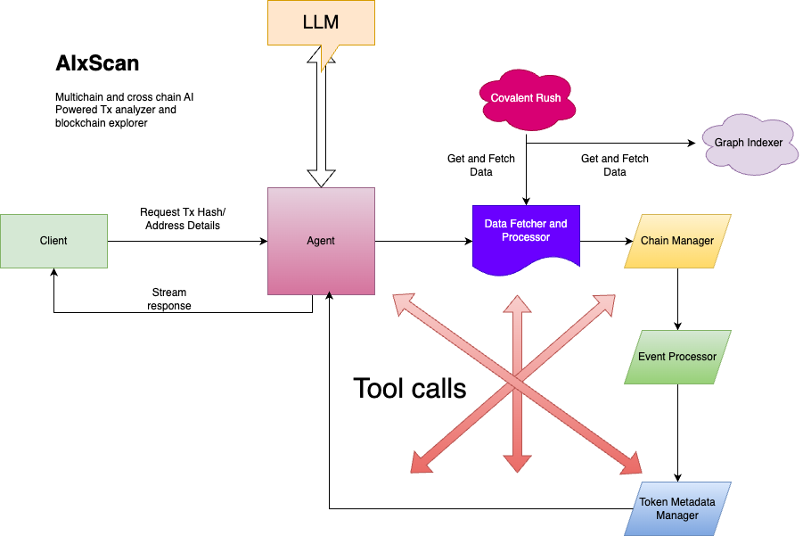

# AIxScan - AI-Powered Cross-Chain Blockchain Explorer

## Overview
AIxScan is an advanced AI-powered blockchain transaction analyzer and cross-chain explorer. It provides deep insights into blockchain transactions, addresses, tokens, and NFTs by leveraging AI to interpret transaction data meaningfully. AIxScan enables users to understand what happens in a transaction beyond just technical details, providing an intuitive and human-like explanation.

## Key Features
- **AI-Powered Transaction Analysis**: Generates detailed and intuitive explanations for transaction activity.
- **Cross-Chain Support**: Works across multiple blockchain networks to analyze transactions.
- **Comprehensive Transaction Breakdown**: Provides insights into transfers, swaps, contract interactions, and costs.
- **Security Risk Assessment**: Analyzes contract verifications and potential security risks.
- **Address & Token Analysis**: Supports wallet address analytics and token metadata retrieval.
- **Efficient Gas Cost Analysis**: Evaluates gas efficiency and transaction costs.

## System Architecture
### Technical Flow Diagram
Below is the architecture diagram illustrating how AIxScan processes transaction analysis:



### Components Breakdown
1. **Client**: Sends transaction hash or address details for analysis.
2. **Agent**: Central AI entity handling requests, interfacing with LLM, and returning structured responses.
3. **LLM (Large Language Model)**: Enhances analysis by interpreting blockchain data into a human-readable format.
4. **Data Fetcher & Processor**: Fetches and processes transaction data from sources like Covalent Rush and The Graph.
5. **Chain Manager**: Handles interactions across multiple blockchains.
6. **Event Processor**: Deciphers contract calls, token movements, and smart contract interactions.
7. **Token Metadata Manager**: Retrieves metadata for tokens and NFTs to enhance understanding.
8. **Tool Calls**: Additional utilities for improving data interpretation.

## Installation and Setup
### Prerequisites
- Node.js (v16+ recommended)
- Yarn (Package Manager)
- Docker (Optional, for running services locally)

### Installation
```sh
git clone https://github.com/yourrepo/aixscan.git
cd aixscan
yarn install
```

### Running the Project
```sh
yarn dev
```

### Powered by 
- Covalent Gold Rush API's
- Graph Protocol
- Opsec

## Contribution
Feel free to open an issue or submit a pull request to enhance AIxScan.

AIxScan: The AI-powered cross-chain blockchain explorer 🚀

